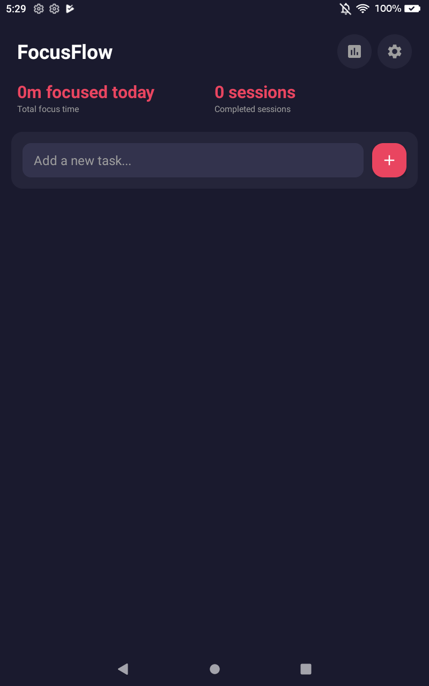
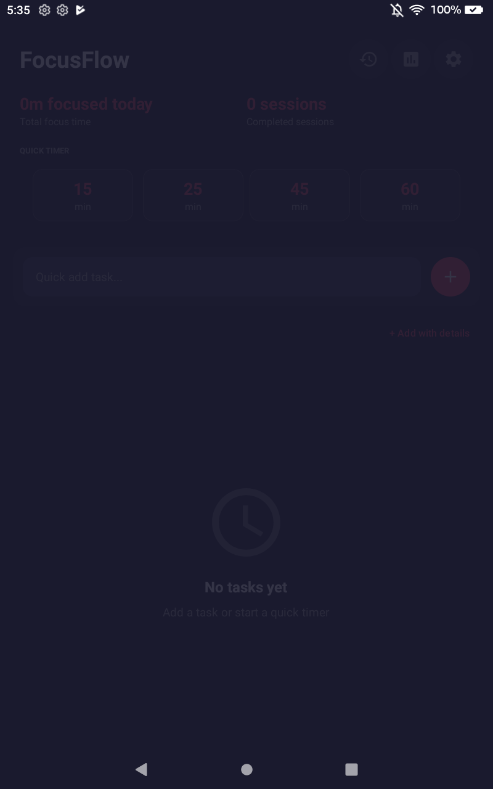
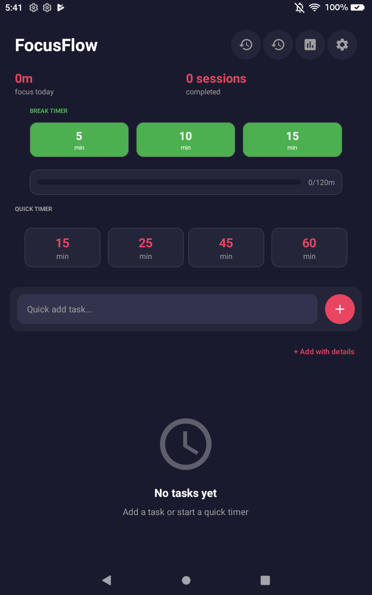
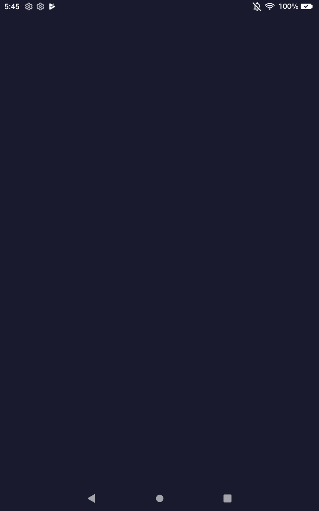

# FocusFlow - Pomodoro Timer & Task Manager

🚀 **Live Website:** https://chartmann1590.github.io/FocusFlow/

A beautiful, feature-rich Pomodoro timer and task manager app for Android with focus tracking, statistics, ambient sounds, and more.

## Features

### ⏱️ Pomodoro Timer
- Quick timer presets (15, 25, 45, 60 minutes)
- Customizable work and break durations
- Visual circular progress indicator
- Sound and vibration notifications

### ✅ Task Management
- Create tasks with title, description, and estimated duration
- 6 categories: Work, Personal, Study, Health, Creative, Other
- 3 priority levels: High, Medium, Low
- Filter by category, priority, or completion status
- Archive completed tasks

### 📊 Statistics & Tracking
- Daily focus time tracking
- Session history with timestamps
- Weekly report with charts
- Daily streak tracking
- Best productivity day insights

### 🔊 Ambient Focus
- Sound selection: Rain, Coffee Shop, Forest, Ocean, White Noise
- Keep screen on during focus sessions
- Auto-start breaks/work options

### 🎨 Design
- Beautiful dark theme with coral accents
- Material Design 3 components
- Celebration animations on task completion
- Responsive and intuitive interface

## Screenshots

| Main Screen | Timer | Statistics |
|-------------|-------|------------|
|  |  |  |

| Weekly Report |
|---------------|
|  |

## Live Website

**🌐 Visit our landing page:** https://chartmann1590.github.io/FocusFlow/

The website features:
- Full landing page with SEO optimization
- Feature showcase
- Screenshot gallery
- How it works section
- Mobile responsive design

## Tech Stack

- **Language:** Kotlin
- **UI:** Android Views, Material Design 3
- **Architecture:** MVVM with LiveData
- **Data:** SharedPreferences with Gson
- **Build:** Gradle with Kotlin DSL

## Installation

### From Source
```bash
# Clone the repository
git clone https://github.com/chartmann1590/FocusFlow.git

# Open in Android Studio
# Build and run on device/emulator
```

### Pre-built APK
Download the latest APK from the [Releases](https://github.com/chartmann1590/FocusFlow/releases) page.

## Support the Project

If FocusFlow helps you stay productive, consider [buying me a coffee](https://www.buymeacoffee.com/charleshartmann)!

[](https://www.buymeacoffee.com/charleshartmann)

## License

MIT License - See [LICENSE](LICENSE) for details.

---

⭐ Star this repo if you find it useful!